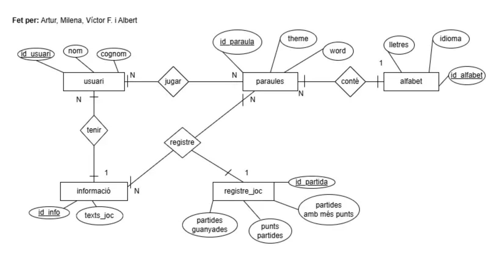
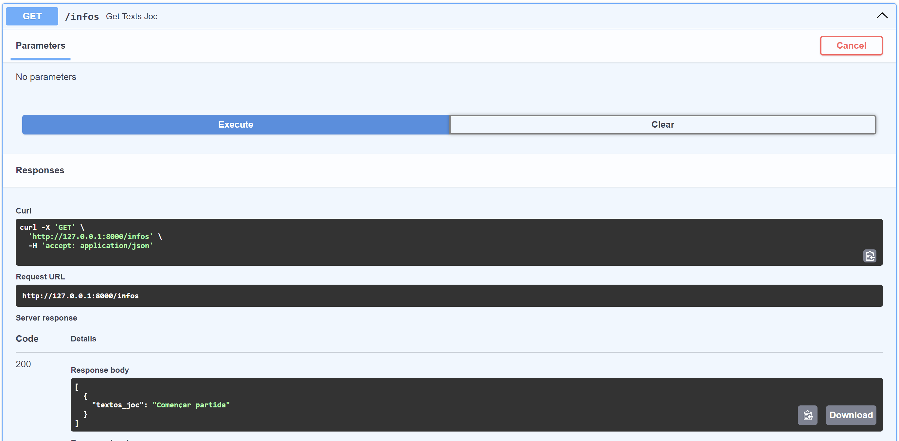
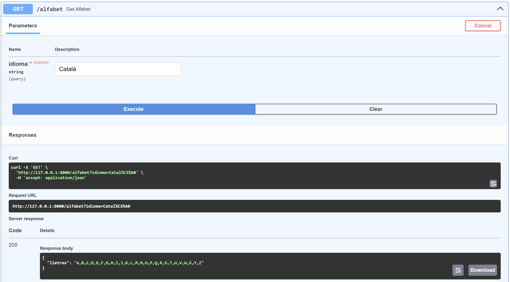
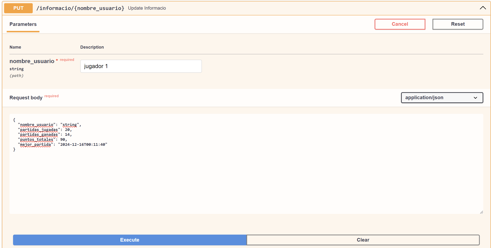
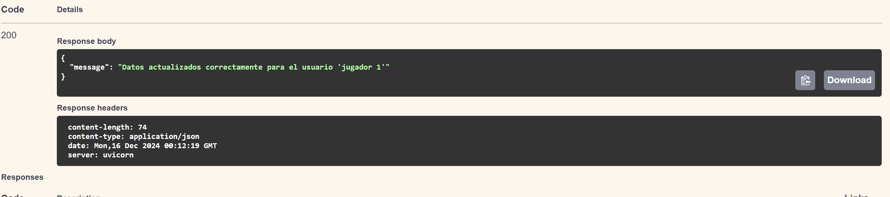
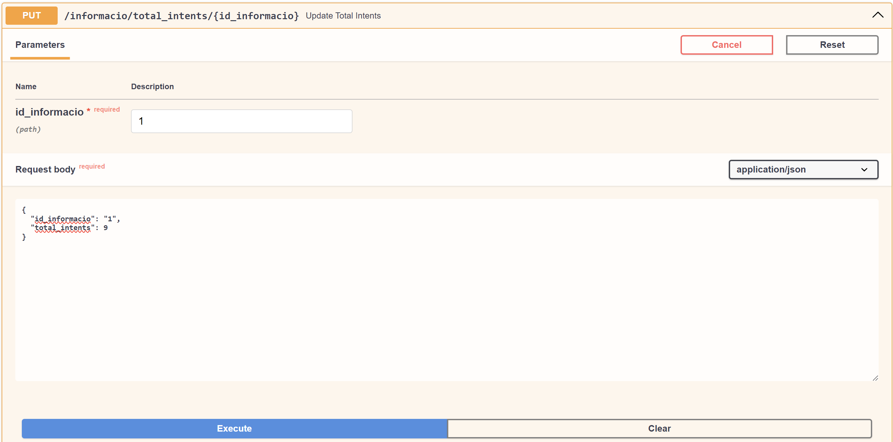
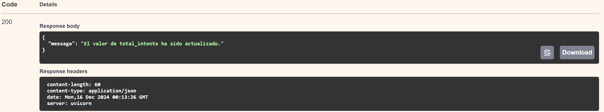

# ACTVITAT 11

Diseño base de datos (al final he hecho cambios en en la base de datos porque el diseño principal no era el adecuado)

Mostrar texto "Començar partida"

Mostrar texto abecedario según un idioma

Actualizar estadisticas de usuario

Modificar intentos

